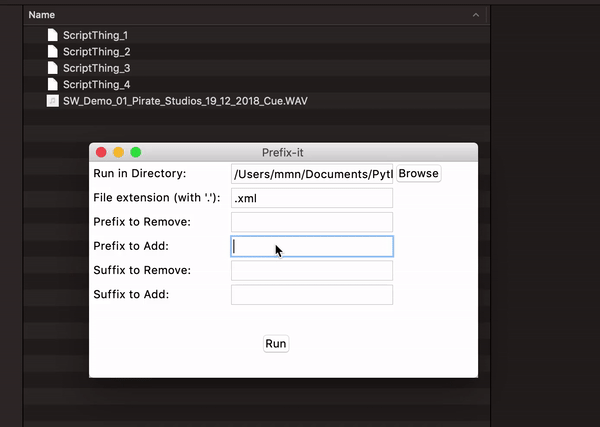

# AudioRenamer
Script to batch rename files to keep to naming conventions 

Browse to directory containing files needing editing. 
Enter the extension of the files. 
Enter a prefix to remove, prefix to add, suffix to remove and suffix to add. 
 
Known issue: Running the mac build on Mojave causes button text to disappear. Just resize the window to make it show again. Or change your appearance settings to use 'light mode'.

