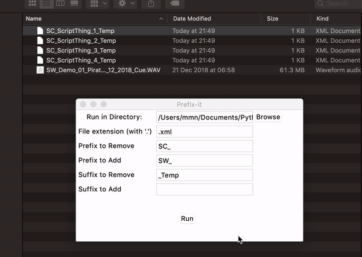

# AudioRenamer
Script to batch rename files to keep to naming conventions

Browse to directory containing files needing editing.
Enter the extension of the files.
Enter a prefix to remove, prefix to add, suffix to remove and suffix to add.

